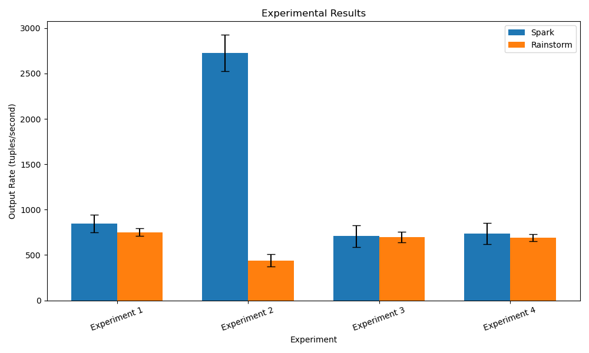

# RainStorm Stream Processing

Our RainStorm design follows a leader-worker architecture with a lightweight framework for low-latency streaming of tuples using RPC calls.

The leader manages all necessary state job state for global control, incuding job initiation, task scheduling, routing-table construction, autoscaling, exactly-once semantics, and failure recovery upon worker crashes. Workers host RainStormTask instances that run user-supplied transform, filter, and aggregate operators.

RainStorm additionally supports an arbitrary number of stages, each with parallel tasks connected via TCP.

---

## Testing on Real Datasets

RainStorm was benchmarked against Apache Spark on two datasets, a [Google+ social network graph](https://snap.stanford.edu/data/ego-Gplus.html), and an [English Wikipedia dataset](https://www.cs.upc.edu/~nlp/wikicorpus/). The social network graph included connections between users and user features. The Wikipedia dataset included XML-structured text from Wikipedia articles.

**Experiment 1:**
Using the Google+ social network graph, we filtered for users that had “New Jersey” as a feature, and then aggregated these users by counting them (`mp4/data/exp1.py`). In our RainStorm implementation, this was modeled by the following three stages:
(UserID, feature_names) => (UserID, feature_names) if “New Jersey” in feature_names
(UserID, feature_names) => (“New Jersey”, 1)
(“New Jersey”, 1) => Count(values)

**Experiment 2:**
Using the Google+ social network graph, we found features for every user in the dataset, and counted the number of times each feature was represented(`mp4/data/exp2.py`). In our RainStorm implementation, this was modeled by the following two stages:
(feature_name) => (feature_name, 1)
(feature_name, 1) => Count(values)

**Experiment 3:**
Using the Wikipedia dataset, we found documents that contained the word “poet” and filtered for these. Then, we counted the total number of these documents (`mp4/data/exp3.py`). In our RainStorm implementation, this was modeled by the following three stages:
(DocumentID, text) => (DocumentID, text) if “poet” in text
(DocumentID, text) => (“poet”, 1)
(“poet”, 1) => Count(values)

**Experiment 4:**
Using the Wikipedia dataset, we found documents that contained the word “cat” and filtered for these. Then, we output the reversed text of each document (`mp4/data/exp4.py`). In our RainStorm implementation, this was modeled by the following two stages:
(DocumentID, text) => (DocumentID, text) if “cat” in text
(DocumentID, text) => (DocumentID, Reverse(text))

## Results



Our implementation performs comparably to Apache Spark in Experiments 1, 3, and 4. In all cases, it achieves slightly lower output, measured in tuples per second, than Apache Spark does. In these experiments, the values in the tuple were large blocks of dense text, suggesting that the cost of reading input, writing output, and transmitting tuples across the network were not the bounding factors. Since Apache Spark is written in Java and RainStorm is in Go, their runtimes for each operation should be comparable. 

However, there is an extremely large difference between Apache Spark and RainStorm for Experiment 2. Since each of the tuples are small, and there are far more tuples being inputted than in any of the other experiments, this task appears to be bounded by the input rate, output rate, and network bandwidth. Here, we can see that Apache Spark far outperformed RainStorm since RainStorm relies on HyDFS to read and write from files. Since each tuple’s information is written individually to state files, write-ahead logs, and the output, the time-per-tuple stays constant regardless of the input size. In contrast, Apache Storm has optimizations like batching writes which makes the time grow sub-linearly.

--

## Repo Structure

```
mp1/config/ -> Holds `machines.txt` with VM addresses for MP 1, and any other configuration files.
mp<N>/reports/ -> Written reports to submit (CS425_MP<N>Report.pdf), plots, and code for plotting.
mp<N>/scripts/ -> Shell scripts to populate vms, generate dummy data, and test (`populate_vms.sh`, `generate_data.sh`, etc).
mp<N>/src/ -> Source files holding client and server logic.
```

## Setup

When running all scripts, make sure they are run from the root directory of this repository, on your local machine.

In the `scripts/` folder, replace the `USER` and `SSH_KEY` variables with your username and path to your SSH key, respectively, in the following files: `kill_servers.sh`, `populate_vms.sh`, `start_dgrep_servers.sh`, `start_introducer.sh`, `start_servers.sh`.
You can also change the `DEST_PATH` variable these scripts to change where the files are copied to on the VMs. By default, they are copied to the user's home directory.

You can then set up the VMs by running the `./scripts/populate_vms.sh` script from your local machine.

This will copy over the necessary files for both MP4 and the distributed grep program to all 10 VMs, make the destination directories, and build the code on the VMs.
The output program `server` should be in the folder `~/mp4` and the output programs `dgrep_server` and `dgrep_client` should be in `~/mp1` on all VMs.
It also removes previous log files generated on the VMs: `server.log` and `dgrep_server.log`.

### Recommended method to run:
1. Run the script `./scripts/populate_vms.sh` from your local machine to set up the VMs.
2. SSH into one of the VMs and start the introducer by running `./server <DISSEM_MODE> <SUSPICION>`, where `<DISSEM_MODE>` is either `gossip` or `ping`, and `<SUSPICION>` is either `suspect` or `nosuspect`.
   For example, to run the introducer on VM 3 with ping-ack, no suspicion:
   ```
   ./server gossip nosuspect
   ```
3. Run the script `./scripts/start_servers.sh <I> "<VMs>"` from your local machine to start the non-introducer MP4 servers on the VMs specified in `<VMs>` (a list of numbers 1-10), where `<I>` is the number of the introducer VM.
   Note the quotes around the list of VMs are necessary, and the introducer must already be running.
   This script will also stop any existing distributed grep or MP4 servers running on the VMs and start new servers for both.
   Note that the distributed grep server will not be started on the introducer VM, only the VMs specified in `<VMs>`.
   The distributed grep servers run on port `9091`, and the MP4 servers run on ports `9097`, `9098`, and `9099`.
   For example to start the MP4 servers on VMs 1, 2, 4, and 5, introducing them to the introducer on VM 3.
   ```
   ./scripts/start_servers.sh 3 "1 2 4 5"
   ```

   To join the server locally while ssh'd into another machine, simply do `./server <INTRODUCER_HOSTNAME>`.
4. The server supports the following commands basic membership and failure detection commands:
   - `list_mem`: list the membership list
   - `list_self`: list self’s id
   - `join`: join the group (implicit)
   - `leave`: voluntarily leave the group (different from a failure)

   As well as the HyDFS requests below:
   - `create localfilename HyDFSfilename`: add localfilename to HyDFS as HyDFSfilename
   - `get HyDFSfilename localfilename`: fetch HyDFSfilename to local dir as localfilename
   - `append localfilename HyDFSfilename`: append contents of localfilename to HyDFSfilename
   - `merge HyDFSfilename`:
   - `ls HyDFSfilename`: lists location of HyDFSfilename (primary and replicas)
   - `liststore`: lists files stored at any process/VM
   - `getfromreplica VMaddress HyDFSfilename localfilename`: fetch HyDFSfilename to localfilename from VMaddress (replica)
   - `multiappend(HyDFSfilename, VMi, … VMj, localfilenamei,....localfilenamej)`: runs multiple appends synchronously
   
5. Run rainstorm commands in the following format:
   ```
   rainstorm <Nstages> <Ntasks_per_stage> <op1_exe> <op1_args> … <opNstages_exe> <opNstages_args> <hydfs_src_directory> <hydfs_dest_filename> <exactly_once> <autoscale_enabled> <INPUT_RATE> <LW> <HW>
   ```
 
- with additional support for `list_tasks` and `kill_task <VM id> <task pid>`.

6. Clean up any running servers after you are finished by running `./scripts/kill_servers.sh "<VMs>"` from your local machine, where `<VMs>` is a list of numbers 1-10.
   For example, to kill the servers on VMs 1, 2, 3, 4, and 5:
   ```
   ./scripts/kill_servers.sh "1 2 3 4 5"
   ```

### Other ways to run:

The introducer must be started manually by running `./server <DISSEM_MODE> <SUSPICION>` on the introducer VM, where `<DISSEM_MODE>` is either `gossip` or `ping`, and `<SUSPICION>` is either `suspect` or `nosuspect`.

Running `./mp3/scripts/start_servers.sh <I> "<VMs>"` will start the non-introducer MP4 servers on the VMs specified in `<VMs>` (a list of numbers 1-10), where `<I>` is the number of the introducer VM.
Note the quotes around the list of VMs are necessary, and the introducer must already be running.
This script will also stop any existing distributed grep or MP4 servers running on the VMs and start new servers for both.
Note that the distributed grep server will not be started on the introducer VM, only the VMs specified in `<VMs>`.
The distributed grep servers run on port `9091`, and the MP4 servers run on ports `9097`, `9098`, and `9099`. `9100`.
For example the command `./mp3/scripts/start_servers.sh 3 "1 2 4 5"` will start the MP4 servers on VMs 1, 2, 4, and 5, introducing them to the introducer on VM 3.

Running `./mp3/scripts/start_dgrep_servers.sh "<VMs>"` will start the distributed grep servers on the VMs specified in `<VMs>` (a list of numbers 1-10).

Running `./mp3/scripts/kill_servers.sh "<VMs>"` will kill any existing distributed grep or MP4 servers running on the VMs specified in `<VMs>` (a list of numbers 1-10).

Alternatively, the MP4 non-introducer servers can be manually run on each of the VMs by running `./mp5/server <I>`, where `<I>` is the hostname of the introducer VM.

The distributed grep servers can be manually run on each of the VMs by running `./mp1/dgrep_server 9091 <X>` where X is the unique VM number (1-10).

You can ssh into any of the VMs and run the distributed grep client with `./mp1/dgrep_client <GREP_ARGUMENTS>`.
The client will ask each server to search in the file `server.log`, which is the output file of the MP4 server logs.
The list of server IPs and ports can be edited in the file `./mp1/config/machines.txt`.
If an argument of `-c` is used, it must be used alone (i.e. you cannot use `-ic`, you must do `-i -c`).
